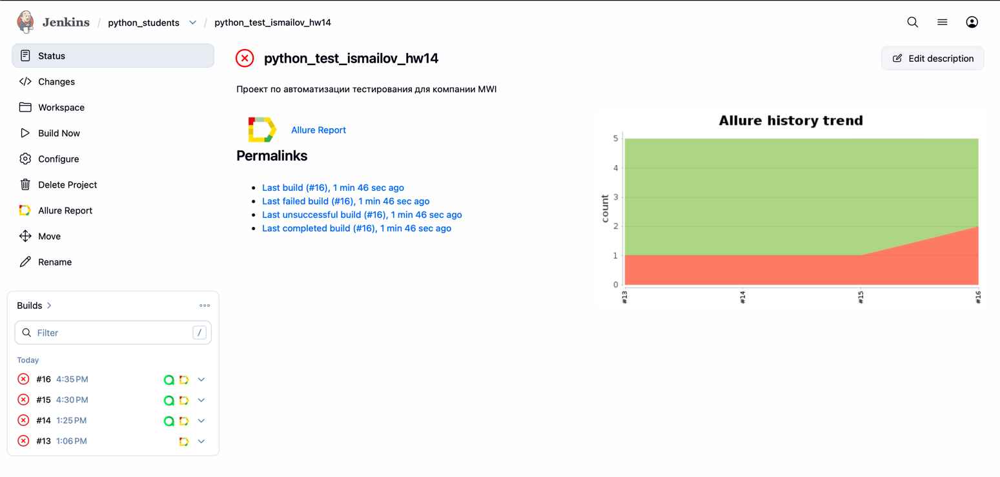
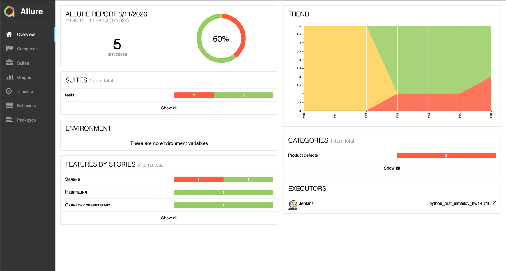
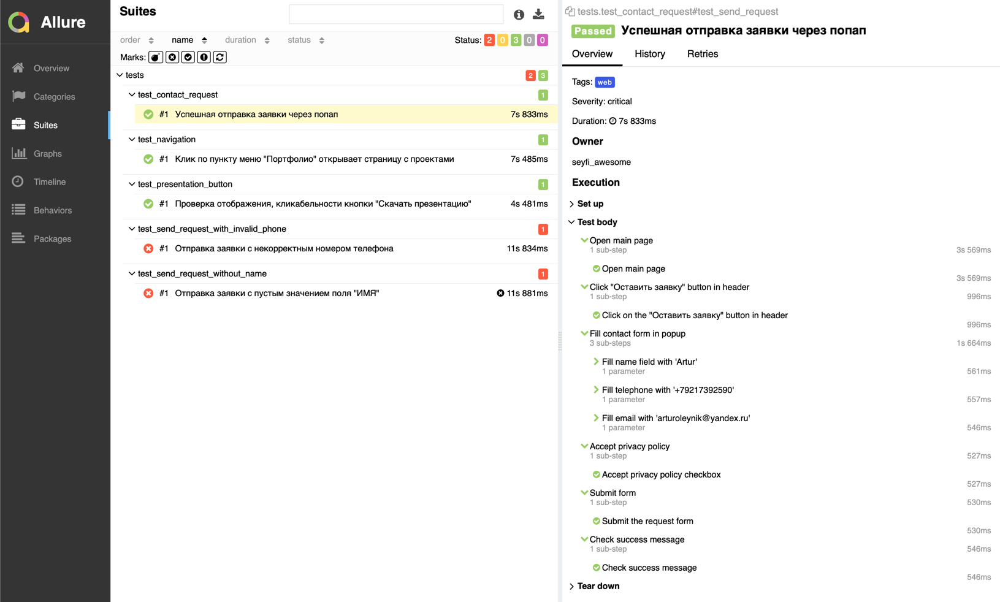
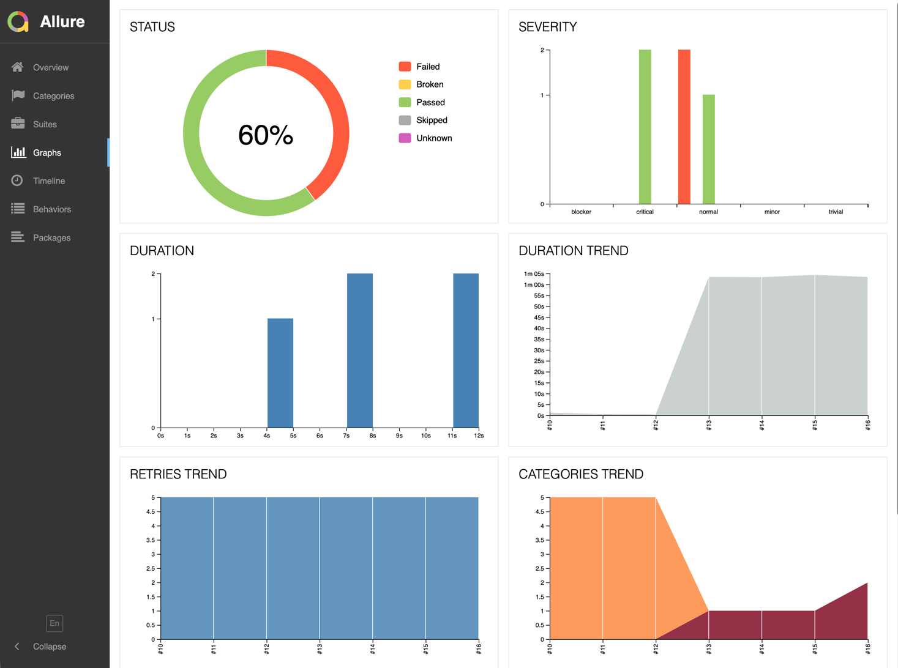
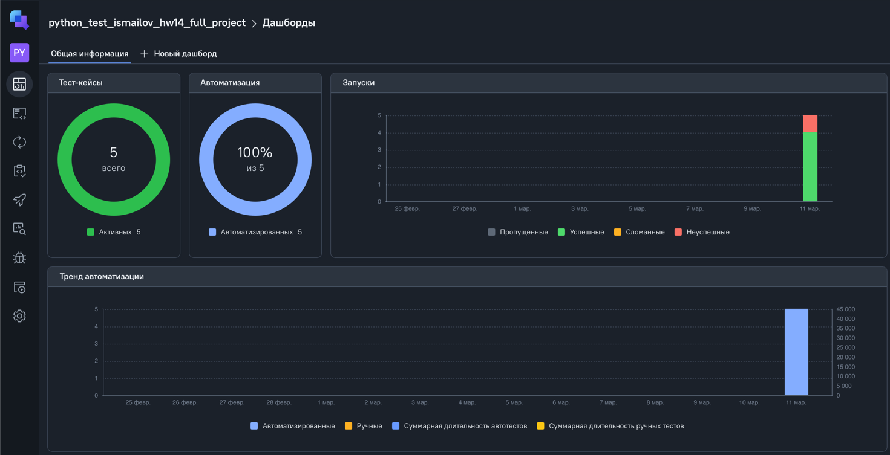
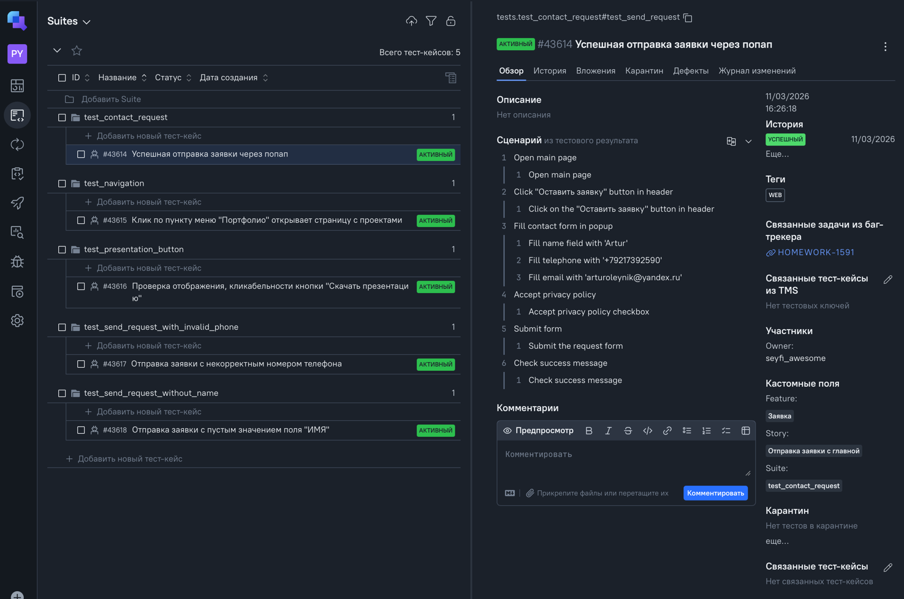
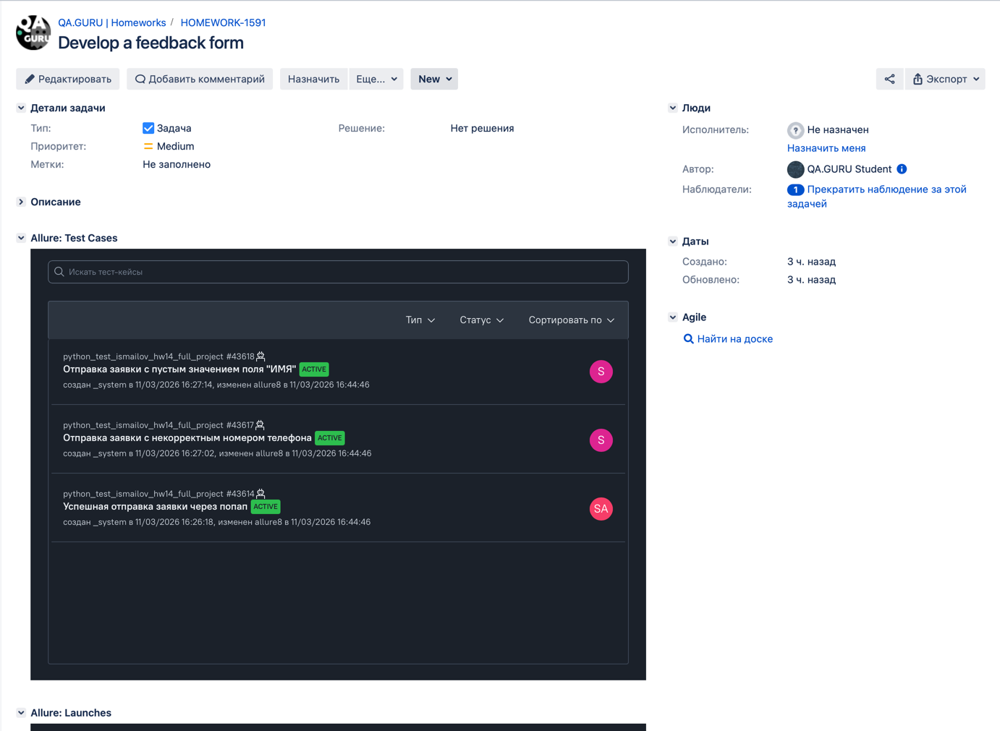
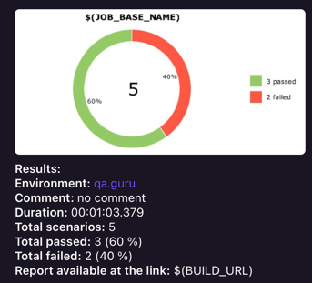

# Проект по автоматизации тестирования для компании [MWI](https://mwi.me/)
> MWI — полносервисное digital-агентство с собственным отделом разработки
## **Содержание:**
____
* <a href="#tools">Технологии и инструменты</a>
* <a href="#cases">Примеры автоматизированных тест-кейсов</a>
* <a href="#jenkins">Сборка в Jenkins</a>
* <a href="#console">Запуск из терминала</a>
* <a href="#allure">Allure отчет</a>
* <a href="#allure-testops">Интеграция с Allure TestOps</a>
* <a href="#jira">Интеграция с Jira</a>
* <a href="#telegram">Уведомление в Telegram при помощи бота</a>
* <a href="#video">Примеры видео выполнения тестов на Selenoid</a>
----
<a id="tools"></a>
## <a name="Технологии и инструменты">**Технологии и инструменты:**</a>

<p align="center">  
<a href="https://www.jetbrains.com/idea/"></a>  
<a href="https://www.java.com/"></a>  
<a href="https://github.com/"></a>
<a href="https://aerokube.com/selenoid/"></a>  
<a href="ht[images](images)tps://github.com/allure-framework/allure2"></a> 
<a href="https://qameta.io/"></a>   
<a href="https://www.jenkins.io/"></a>  
<a href="https://www.atlassian.com/ru/software/jira/"></a>  
</p>

<a id="cases"></a>
## <a name="Примеры автоматизированных тест-кейсов">**Примеры автоматизированных тест-кейсов:**</a>
____
-  *Проверка успешной отправки заявки через попап*
-  *Клик по пункту меню "Портфолио" открывает страницу с проектами*
-  *Проверка отображения, кликабельности кнопки "Скачать презентацию*
-  *Проверка возможности отправки заявки с некорректным номером телефона*
-  *Отправка заявки c пустым значением поля "ИМЯ"'*


____
<a id="jenkins"></a>
## </a><a name="Сборка"></a>Сборка в [Jenkins](https://jenkins.autotests.cloud/job/Kod3ik_qa_guru_x5/)</a>
____
<p align="center">  
<a href="https://jenkins.autotests.cloud/job/Kod3ik_qa_guru_x5/"></a>  
</p>


### **Параметры сборки в Jenkins:**

- *browser (браузер, по умолчанию chrome)*
- *browserVersion (версия браузера, по умолчанию 128.0)*
- *browserSize (размер окна браузера, по умолчанию 1920x1080)*
- *baseUrl (адрес тестируемого веб-сайта)*
- *remoteUrl (логин, пароль и адрес удаленного сервера Selenoid)*

<a id="console"></a>
## Команды для запуска из терминала
___
***Локальный запуск:***
```bash  
pytest tests/
```

***Удалённый запуск через Jenkins:***
```bash  
pytest tests/ \
  --browser=${browser} \
  --browser-version=${browserVersion} \
  --browser-size=${browserSize} \
  --base-url=${baseUrl} \
  --remote-url=${remoteUrl}
```
___
<a id="allure"></a>
## </a> <a name="Allure"></a>Allure [отчет](https://jenkins.autotests.cloud/view/python_students/job/python_test_ismailov_hw14/16/allure/)</a>
___

### *Основная страница отчёта*

<p align="center">  
  
</p>

___
### *Тест-кейсы*

<p align="center">  
  
</p>

___
### *Графики*
  <p align="center">  


___
<a id="allure-testops"></a>
## </a>Интеграция с <a target="_blank" href="https://allure.autotests.cloud/project/5153/dashboards">Allure TestOps</a>
____
### *Allure TestOps Dashboard*

<p align="center">  
  
</p>  

### *Авто тест-кейсы*

<p align="center">  
  
</p>

___
<a id="jira"></a>
## </a> Интеграция с <a target="_blank" href="https://jira.autotests.cloud/browse/HOMEWORK-1591">Jira</a>
____
<p align="center">  
  
</p>

____
<a id="telegram"></a>
## </a> Уведомление в Telegram
____
<p align="center">  
  
</p>


